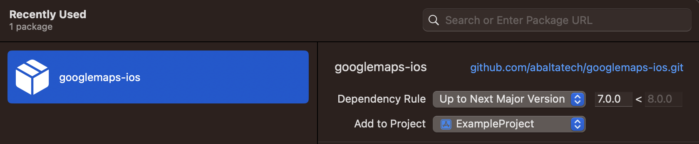

# googlemaps-ios

This is a swift package that exposes GoogleMaps.xcframework, GoogleMapsBase.xcframework and GoogleMapsCore.xcframeworkbuilt downloaded from the official ) ios sdk documentation. This eliminates the need to store them in your repository.
# Table of Contents
- [Installation](#installation)
  - [Swift Package Manager](#swift-package-manager)
  - [Xcode](#xcode)
- [Documentation](#documentation)
- [Usage](#usage)
## Installation

To use `Google Maps` in your own project, you can use:   
### Swift Package Manager

```swift
// swift-tools-version:5.6
import PackageDescription

let package = Package(
  name: "MyPackage",
  dependencies: [
    .package(
      url: "https://github.com/abaltatech/googlemaps-ios.git", 
      .upToNextMajor(from: "7.3.0") // or `.upToNextMinor
    )
  ],
  targets: [
    .target(
      name: "MyTarget",
      dependencies: [
        .product(name: "GoogleMaps", package: "googlemaps-ios")
      ]
    )
  ]
)
```

### Xcode
Add https://github.com/abaltatech/googlemaps-ios.git to your package dependencies 
  

## Documentation
You can view the api reference docs at https://developers.google.com/maps/documentation/ios-sdk/reference
For more information you can visit the official [Maps SDK for iOS](https://developers.google.com/maps/documentation/ios-sdk) site.
## Usage
Include the headers and follow the reference docs
```objective-c
#import <GoogleMaps/GoogleMaps.h>
```
